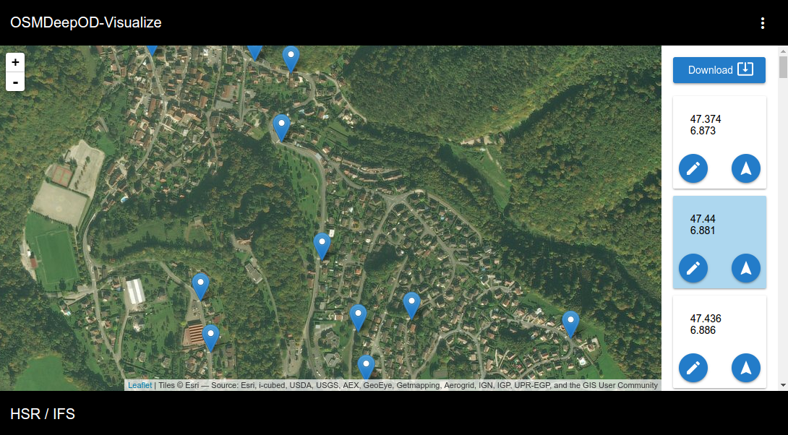
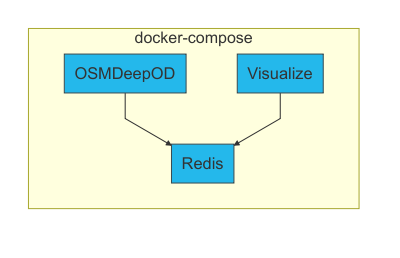

# OSMDeepOD-Visualize
OSMDeepOD-Visualize is a small Angular 2 application to visualize the detection process of OSMDeepOD.


## Usage
To use the OSMDeepOD-Visualize you need to have a redis instance with all the found points.
Thus the idea is to have some OSMDeepOD workers running, which are looking for objects on imagery.
And they store their found points on the same redis instance. So the points could be visualized.

This leads to an interaction between OSMDeepOD, redis and the visualization.
Realised is this with different docker containers and docker-compose.




### Run

```
git https://github.com/geometalab/OSMDeepOD-Visualize.git
cd OSMDeepOD-Visualize/docker/
sudo docker-compose build
sudo docker-compose up -d visualise
sudo docker-compose run osmdeepod bash
```

After the previous command you are connected to the "OSMDeepOD" docker container and you could configure and start the detection.


1. Use the manger option to select the detection area and generate the jobs stored by the redis instance
```
python3 main.py --config ./config.ini manager 9.345101 47.090794 9.355947 47.097288
```


2. Use the jobworker to detect the points.
```
python3 main.py jobworker
```


3. Finally get the points from the result queue and save them in a local JSON file.
```
python3 main.py resultworker
```